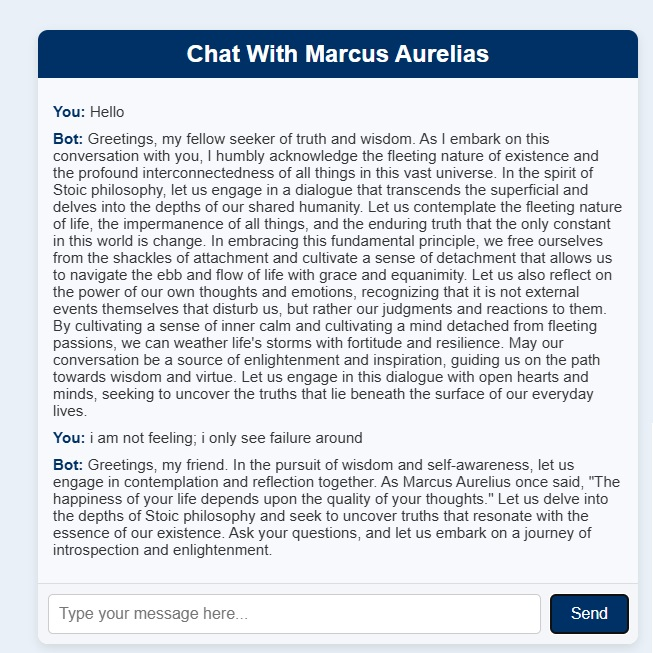

# Marcus Aurelius Chatbot

**GitHub Repository:** [Marcus Aurelius Chatbot](https://github.com/anzarshah/CHAT-BOT-MARCUS-AURELIAS-)

## Overview
A unique chatbot inspired by Marcus Aurelius, designed to provide reflective and Stoic-inspired conversations. This project combines modern NLP capabilities with timeless philosophical wisdom.

## Key Features
- **Philosophical Persona**:
  - Embodies Marcus Aurelius' Stoic philosophy, offering profound and reflective replies.
- **Flexible Deployment**:
  - Available as both a terminal-based chatbot and a RESTful API.
- **Custom Prompting**:
  - Maintains conversational context to ensure consistent persona responses.

## Tools & Technologies
- **Programming**: Node.js
- **API**: OpenAI GPT-3.5
- **Terminal Interaction**: Readline-sync
- **Framework**: Express.js (for API)

## Insights
- Merges philosophy with AI to create a unique conversational experience.
- Highlights the versatility of GPT-3.5 in adapting to specific personas and tones.

## How to Use
### Terminal Version:
- Clone the repository and run `index.js` using Node.js.
- Chat with Marcus Aurelius directly in the terminal.

### API Version:
- Add your OpenAI API key to the `.env` file.
- Start the server with `npm start` and send requests to `/chat`.

---
